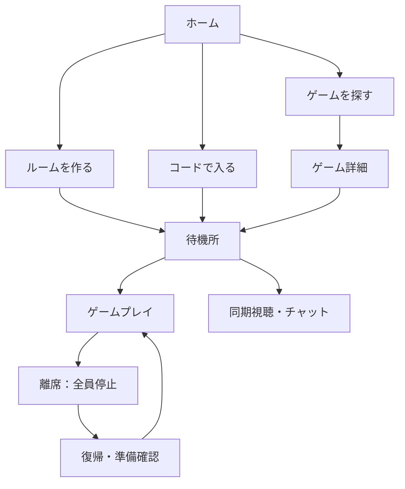

# HideGames 機能要件

## 1. プロダクト概要

HideGames は、友達とルームコードで集まり、定番ゲーム・協力ゲーム・パーティーゲームを遊べるデスクトップ向けゲームハブである。

最大の特徴は、ユーザーが設定したグローバルショートカットでアプリのウィンドウを即座に非表示にできること。オンラインゲーム中に誰かが離席した場合は、全参加者のゲームを停止し、全員が気持ちよく再開できる体験を提供する。

## 2. 対象プラットフォーム

| 項目 | 要件 |
| --- | --- |
| 対象OS | macOS / Windows 向けデスクトップアプリ |
| 実装方針 | Web技術でゲーム画面を作成し、デスクトップアプリの機能でウィンドウ・グローバルショートカットを制御する |
| 初期言語 | 日本語 |
| 将来の言語 | 英語などを追加できる設計にする |

> 注記: Webブラウザ単体ではOSレベルのグローバルショートカットやウィンドウ非表示を確実に扱えないため、デスクトップアプリとして提供する。

## 3. アプリ基本機能

| 機能 | 要件 |
| --- | --- |
| ホーム | 最近遊んだゲーム、お気に入り、フレンドの状態、おすすめゲームを表示する |
| ゲーム一覧 | ジャンル・人数・対戦/協力などでゲームを探せる |
| アカウント | ゲスト利用とアカウント登録の両方を提供する |
| 保存データ | プロフィール、フレンド、設定、実績、戦績、リプレイを保存する |
| 画面 | ホーム、ゲーム一覧、ルーム、YouTube、フレンド、プロフィール、設定を用意する |
| 拡張性 | 新しいゲームを後からゲーム一覧・ルーム基盤へ追加できる構造にする |

## 4. 離席・即時非表示機能（中核）

### 4.1 基本動作

| 項目 | 要件 |
| --- | --- |
| 離席キー | ユーザーが任意に設定できるグローバルショートカットで実行する |
| 非表示 | 離席キーを押した瞬間、HideGames の全ウィンドウを非表示にする |
| 復帰 | 同じキーまたは設定済みの復帰キーで、直前の位置・サイズ・画面へ戻す |
| 適用範囲 | ゲーム、ルーム、YouTube、チャットなど、アプリ内のすべての画面で共通に動作する |
| キー競合 | 設定時にOSやアプリ内操作との競合を確認する |
| キーの可視化 | 必要時だけ、設定済みの離席キーを控えめに表示する |
| 失敗時 | 明るさ変更などの補助機能に失敗しても、離席・ゲーム停止は必ず実行する |

### 4.2 オンライン中の共通挙動

オンラインゲームでは、誰か1人が離席した時点でゲーム全体を停止する。ゲームごとに異なるAFKペナルティや自動操作を設けず、すべてのゲームに共通するルールとする。

| 状態 | 動作 |
| --- | --- |
| 誰かが離席 | サーバーが全参加者のゲーム状態を即時停止する |
| 他参加者の画面 | ゲーム画面を全面モーダルで覆い、`<ユーザー名> さんが一時的に離席しています` と表示する |
| 離席者の画面 | HideGames のウィンドウを非表示にする |
| 複数人が離席 | 離席中ユーザーを一覧表示し、全員が戻るまで停止を継続する |
| 離席者が復帰 | 全参加者に `<ユーザー名> さんが戻りました` と通知する |
| 再開 | 全員の準備確認後、3秒カウントダウンを表示して同時に再開する |
| 通信切断 | `接続を待機中` 画面でゲームを停止し、再接続を試行する |
| 再接続 | 同じルーム・同じゲーム状態へ復帰できる |
| 長時間の未復帰 | ホストまたはルームの合意により退出処理を選べる。自動失格を標準動作にはしない |
| 再停止連打 | 再開後の短い再停止待機時間などで、連続操作による妨害を防ぐ |

### 4.3 停止中のUX

- 離席理由は他プレイヤーへ公開しない。表示は「一時離席中」のみとする。
- 離席者は任意で「すぐ戻る」「少し待って」などの定型メッセージを選べる。
- 停止中もテキストチャット、スタンプ、ルール確認、操作確認を利用できる。
- 誤って復帰キーを押した場合に備え、ゲームを再開する前に準備確認を行える。
- ルーム内で離席・復帰の履歴（誰が、いつ、どのくらい）を確認できる。
- 退出・ルーム解散などの取り消しにくい操作には確認ダイアログを表示する。

### 4.4 ディスプレイの明るさ連動

| 項目 | 要件 |
| --- | --- |
| 離席時 | 設定が有効なら、対象ディスプレイの明るさを指定値まで上げる |
| 復帰時 | 離席前の明るさをディスプレイごとに復元する |
| 設定 | 有効/無効、離席時の明るさ、変化速度、対象（メインのみ/すべて）を設定できる |
| テスト | 設定画面から明るさ変更を試せる |
| 外部モニター | 対応機種のみ変更する。非対応でも離席機能は正常に動作する |

## 5. オンライン・ルーム機能

| 機能 | 要件 |
| --- | --- |
| ルーム作成 | ホストがゲーム、人数、公開設定を選んで作成できる |
| 参加方法 | 短いルームコード、招待リンク、フレンド招待で参加できる |
| ルームコード | 作成時にワンクリックでコピーでき、QRコードでも共有できる |
| 待機所 | 参加者一覧、準備完了、ゲーム選択、チャット、ルール確認を表示する |
| 人数案内 | 開始可能人数と不足人数を分かりやすく表示する |
| 再戦 | 同じメンバー・設定で再戦できる |
| 観戦 | 対応ゲームでは途中観戦し、次ラウンドから参加できる |
| ホスト依存 | ゲーム進行とルーム状態はサーバー側で管理し、ホストが離席・切断してもルームを維持する |
| 安全性 | 招待限定、パスワード、ブロック、通報を提供する |

## 6. 搭載ゲーム

### 6.1 定番ゲーム

| ゲーム | 人数 | 概要 |
| --- | --- | --- |
| オセロ | 2人 | 石を挟み自分の色に変えるボードゲーム |
| 五目並べ | 2人 | 縦・横・斜めに5つ並べる |
| 将棋 | 2人 | 駒を動かして王将を詰ませる |
| チェス | 2人 | 駒の役割を使う戦略ボードゲーム |
| 囲碁 | 2人 | 陣地を囲って競う |
| 大富豪 | 2〜6人 | 手札を早く出し切るカードゲーム |
| UNO風カードゲーム | 2〜8人 | 色・数字・効果カードで競う |
| ババ抜き | 2〜6人 | ジョーカーを最後まで持たないようにする |
| 神経衰弱 | 2〜4人 | 同じ数字のカードを揃える |
| 7並べ | 2〜6人 | 数字を順番につなげて出す |
| 麻雀 | 2〜4人 | 牌を揃えて役を作る |
| すごろく | 2〜6人 | サイコロを振って進む |
| 協力マインスイーパー | 1〜4人 | 地雷の位置を共同で推理する |
| テトリス風対戦 | 2人 | ライン消去で相手に妨害を送る |
| 落ちものパズル | 1〜4人 | 同じ色をつなげて消す |

### 6.2 パーティー・会話ゲーム

| ゲーム | 人数 | 概要 |
| --- | --- | --- |
| 人狼 | 4〜12人 | 正体を隠して議論と投票を行う |
| ワードウルフ | 3〜10人 | 少数派のお題を見抜く |
| クイズ早押し | 2〜10人 | 問題に早く正解して得点する |
| お絵描き伝言 | 3〜10人 | 絵でお題を伝えていく |
| 連想ゲーム | 2〜10人 | 言葉のつながりを楽しむ |
| しりとり | 2〜8人 | 最後の文字をつなぐ |
| 映画監督バトル | 3〜8人 | 演出カードで短い映画の場面を作り、投票する |
| 同時にしゃべれない会議 | 3〜8人 | 発言制限下で事件を解く会話推理ゲーム |
| 架空の国を作る選挙ゲーム | 3〜8人 | 法案と交渉で国の歴史を作る |
| 最後の一文を守る物語ゲーム | 3〜8人 | 秘密の結末を狙いながら共同で物語を作る |

### 6.3 協力・推理ゲーム

| ゲーム | 人数 | 概要 |
| --- | --- | --- |
| 片方だけ見える脱出室 | 2人 | プレイヤーごとに見える情報が異なる脱出ゲーム |
| 地図なし配達 | 2〜4人 | 道を見る人と地図を見る人が連携する配達ゲーム |
| 1人だけ未来を知っている | 2〜5人 | 未来担当の情報をもとに、全員で災害を防ぐ |
| 偽ニュース編集部 | 3〜6人 | 情報の真偽を判断して記事を完成させる |
| 宇宙人の通訳 | 2〜5人 | 未知の言語を解読して宇宙人と交渉する |
| 手紙だけの冒険 | 2〜6人 | 短い手紙だけで意思疎通して冒険する |
| 逃げる美術館 | 2〜5人 | 分担した監視映像から異常を止める |
| 怪盗のアリバイ工作 | 2〜5人 | 証言と行動の矛盾をなくすパズル |
| 幽霊の引っ越し | 2〜4人 | 幽霊の感情を読み、安全に新居へ移す |
| 音だけ迷路 | 2〜4人 | 音だけを頼りに位置を推理して進む |
| 時間を編集する刑事 | 1〜4人 | 監視映像を時間操作して事件の因果を解く |
| 声なしオーケストラ | 2〜6人 | 別々の演奏パートを同期させる協力リズムゲーム |
| 夢の中の法廷 | 3〜8人 | 感情や記憶を証拠にした弁論ゲーム |
| バグを仕様にするゲーム | 1〜4人 | 壊れたゲーム世界のルールを利用して進む |

### 6.4 非対称・対戦ゲーム

| ゲーム | 人数 | 概要 |
| --- | --- | --- |
| 泥棒と警備AI | 2〜6人 | 侵入側と警備側に分かれる非対称対戦 |
| ルールを発明するスポーツ | 2〜8人 | 試合前に得点方法・反則・特殊能力を決める |

### 6.5 オンライン鬼ごっこ

| 項目 | 要件 |
| --- | --- |
| 人数 | 2〜8人 |
| 視点 | 2D見下ろし型 |
| 試合時間 | 3〜5分 |
| 基本ルール | 鬼は逃げる側を全員捕まえる。逃げる側は制限時間を逃げ切る |
| マップ | 草むら、家具、ダクト、ワープ、鍵、出口などのギミックを用意する |
| モード | クラシック、宝石回収、感染鬼、変身鬼ごっこ、チーム戦 |
| 離席時 | 他ゲームと同じく、誰かが離席したら全員のゲームを停止する |

## 7. YouTube・交流機能

| 機能 | 要件 |
| --- | --- |
| YouTube再生 | 公式埋め込みプレーヤーを使用し、動画URL・プレイリストURLを再生できる |
| 同期視聴 | ルーム内で再生・停止・再生位置を同期できる |
| 離席時の動画 | `ゲームと一緒に動画も停止` と `ゲームだけ停止し動画は各自で継続` をルーム設定で選べる |
| 動画検索 | 初期版ではURL貼り付けを中心にする。アプリ内検索は必要に応じて公式APIを利用する |
| 外部リンク | Twitch、Spotifyなどのリンクをルームに共有できる |
| テキストチャット | メッセージ、スタンプ、ゲーム招待を送れる。ゲーム中も右下のチャットドックから利用できる |
| ボイスチャット | 任意で参加・退出できる音声通話を提供する |
| お絵描きボード | 共同落書き、作戦会議、お絵描き伝言に使える |
| 共有メモ | ルーム参加者が共同編集できる簡易メモを提供する |

## 8. ソーシャル・やり込み要素

| 機能 | 要件 |
| --- | --- |
| プロフィール | 表示名、アイコン、称号、プレイ履歴を表示する |
| フレンド | 追加・削除、オンライン状況、ワンクリック招待を提供する |
| 最近遊んだ相手 | 前回のメンバーを簡単に再招待できる |
| お気に入り | よく遊ぶゲームをホーム画面に固定できる |
| 実績 | 初勝利、連勝、協力クリア、鬼ごっこ逃走成功などを記録する |
| ランキング | 対象ゲームごとの成績ランキングを提供する |
| デイリーチャレンジ | 毎日更新されるパズル、クイズ、ミッションを提供する |
| リプレイ | 棋譜・試合結果を保存・共有できる |
| トーナメント | ルーム内大会を自動進行できる |

## 9. 非機能要件

| 項目 | 要件 |
| --- | --- |
| 応答性 | 離席・復帰とゲーム停止は、ユーザーが即時と感じる速度で行う |
| 同期 | 対戦の状態・スコア・勝敗はサーバー側で検証し、不正を防ぐ |
| 耐障害性 | 一時的な通信断後に安全に再接続・再同期できる |
| プライバシー | マイク、通知、データ保存などは利用前に明示的な許可を取る |
| アクセシビリティ | 文字サイズ、色覚配慮テーマ、字幕、音量、キー設定を用意する |
| 通知 | 招待、チャット、再開などの通知を個別にオン・オフできる |
| 音量 | BGM、効果音、ボイスチャット、YouTubeを個別に調整できる |
| UI方針 | 初回画面では `ルームを作る` と `コードで入る` を中心に表示し、複雑な機能は段階的に見せる |

## 10. UI/UX案

### 10.1 UI設計の前提

| 項目 | 内容 |
| --- | --- |
| 画面の目的 | 友達と迷わず集まり、短時間でゲーム開始し、離席後も不安なく全員で再開できること |
| 対象ユーザー | 友達とカジュアルに対戦・協力プレイをしたいPCユーザー |
| 利用状況 | ひとりでゲームを探す時、ルームコードで参加する時、通話・動画を見ながら待機する時、急に離席する時 |
| 最重要情報 | 今すぐ遊ぶための入口、参加中ルームの状態、離席・再開の状況 |
| 最優先CTA | `ルームを作る` と `コードで入る` |
| 対応サイズ | デスクトップを主対象とし、最小ウィンドウ幅でも主要操作を崩さない。将来のモバイル閲覧にも対応可能な構造にする |

### 10.2 情報設計・ナビゲーション

常時表示する左サイドバーで主要な移動先を固定する。ゲームプレイ中は不要なナビゲーションを隠し、ゲームとルーム情報に集中できるようにする。

| ナビゲーション | 内容 |
| --- | --- |
| ホーム | すぐ遊ぶ、最近遊んだゲーム、フレンドの状況、招待を表示 |
| ゲーム | 定番、パーティー、協力・推理、アクションなどから探す |
| ルーム | 参加中の待機所、ゲーム、チャット、共有機能を表示 |
| YouTube | 動画URL・プレイリストURLを再生し、同期視聴を行う |
| フレンド | オンライン状態、招待、最近遊んだ相手を表示 |
| プロフィール | 実績、称号、戦績、リプレイを表示 |
| 設定 | 離席キー、明るさ、音量、通知、アクセシビリティを設定 |



### 10.3 画面別UI案

#### ホーム

| 項目 | 内容 |
| --- | --- |
| 目的 | 最短でルーム作成・参加・ゲーム再開へ進める |
| 最重要情報 | `ルームを作る`、`コードで入る`、招待、参加中ルーム |
| レイアウト | 上部に大きな2つのCTA、その下に「参加中」「フレンドが遊んでいる」「最近遊んだ」を縦に配置 |
| 補足 | 初回ユーザーには、ゲーム一覧より先にルーム作成・参加を見せる |

```text
┌──────────────────────────────────────────────────────────────┐
│ HideGames                         通知   プロフィール          │
├─────────────┬────────────────────────────────────────────────┤
│ ホーム      │ 友達とすぐ遊ぼう                                │
│ ゲーム      │ [ ルームを作る ]  [ コードで入る ]              │
│ ルーム      │                                                │
│ YouTube     │ 参加中のルーム                                  │
│ フレンド    │ ┌────────────────────────────────────────────┐ │
│ プロフィール│ │ 鬼ごっこ / yuta、3人 / 再開待ち              │ │
│ 設定        │ └────────────────────────────────────────────┘ │
│             │ 最近遊んだ　 オセロ　五目並べ　鬼ごっこ         │
└─────────────┴────────────────────────────────────────────────┘
```

#### ゲーム一覧・ゲーム詳細

| 項目 | 内容 |
| --- | --- |
| 目的 | 人数・気分・ジャンルに合うゲームを選び、ルーム作成へ進める |
| 表示順 | お気に入り、最近遊んだ、人数に合うゲーム、全ゲーム |
| フィルター | 人数、対戦/協力、所要時間、ジャンル、難易度 |
| ゲームカード | タイトル、人数、想定時間、ジャンル、短い説明、対応する交流機能を表示 |
| 詳細画面CTA | `このゲームでルームを作る` を最も目立たせる。`ルールを見る` は副次操作とする |

#### ルーム待機所

| 項目 | 内容 |
| --- | --- |
| 目的 | 全員の準備状態を確認し、迷わずゲームを始める |
| 最重要情報 | 選択中ゲーム、参加人数、準備状況、開始ボタン |
| レイアウト | 中央にゲーム情報と参加者、右カラムにチャット・共有メモ・YouTube、下部に開始操作 |
| ホスト操作 | ゲーム変更、公開設定、開始、退出者の扱いを管理できる |
| 参加者操作 | 準備完了、招待、チャット、音声参加、退出を行える |

```text
┌──────────────────────────────────────────────────────────────┐
│ ルーム: A7K9P2       招待をコピー                   設定       │
├───────────────────────────────────────┬──────────────────────┤
│ オンライン鬼ごっこ  2〜8人 / 3〜5分   │ チャット              │
│ [ルールを見る]                        │ yuta: 次これやろう   │
│                                       │ [メッセージを入力]   │
│ 参加メンバー                          ├──────────────────────┤
│ yuta (ホスト)       ● 準備OK          │ 共有メモ / YouTube    │
│ hana                ○ 準備中          │ [URLを貼り付け]       │
│ sora                ● 準備OK          │                      │
│                                       │                      │
│ [フレンドを招待]              [ゲームを開始]                  │
└──────────────────────────────────────────────────────────────┘
```

#### ゲームプレイ

| 項目 | 内容 |
| --- | --- |
| 目的 | ゲームに集中しつつ、対戦相手・接続・離席状態を常に把握できる |
| 常時表示 | 最小限の参加者名、接続状態、ゲーム固有の情報、設定済み離席キーへの導線 |
| 非表示 | 通常時はサイドバー、複雑な設定、長いルール説明を表示しない |
| チャット | 右下に折りたたみ式チャットドックを常設する。開いた時もゲームの重要UIを覆わないように配置する |
| 補助操作 | 音量・退出・ルールは小さなオーバーレイから開く |
| 操作性 | すべてのゲームでキーボード操作・フォーカス状態を明確にする |

```text
┌──────────────────────────────────────────────────────────────┐
│                  ゲームプレイ領域                            │
│                                                              │
│                                                    ┌────────┐│
│                                                    │ チャット ││
│                                                    │ yuta: GG││
│                                                    │ hana: ! ││
│                                                    │ [入力…] ││
│                                                    └────────┘│
└──────────────────────────────────────────────────────────────┘
```

#### ゲーム中チャットドック

| 項目 | 要件 |
| --- | --- |
| 位置 | 右下に固定する。ゲームごとの重要な操作・スコア表示と重なる場合は、そのゲーム用レイアウトに合わせて避ける |
| 表示 | 既定はコンパクト表示。直近メッセージと未読件数を確認できる |
| 展開 | クリックまたは設定済みキーで展開し、メッセージ入力・スタンプ・メンバー名を利用できる |
| 折りたたみ | 再クリック、Esc、またはゲーム操作開始時に折りたためる |
| 通知 | 新着メッセージは小さな未読バッジで知らせる。ゲーム中に大きな通知や画面を遮る表示はしない |
| 停止中 | 全員停止モーダル上でもチャットを開ける。待機中の会話に使える |
| 安全性 | チャット入力にフォーカスしている間は、ゲーム操作キーを入力しない。入力中であることを明確に表示する |

#### 全員停止・離席モーダル

| 項目 | 内容 |
| --- | --- |
| 目的 | 停止理由と次に起きることを明確に伝え、待機中の不安をなくす |
| 表示 | 画面全体を覆う半透明の背景と、中央のモーダル |
| 最重要情報 | `ゲームは一時停止中です` と離席中ユーザー名 |
| 待機中操作 | チャット、スタンプ、ルール確認、退出を提供する |
| 復帰後 | 復帰通知 → 準備確認 → 3秒カウントダウン → 同時再開 |

```text
┌──────────────────────────────────────────────────────────────┐
│                                                                │
│                    ⏸ ゲームは一時停止中です                  │
│                                                                │
│                 yuta さんが一時的に離席しています             │
│                    戻るまでお待ちください                    │
│                                                                │
│              [スタンプ]  [チャットを開く]  [ルールを見る]     │
│                                                                │
└──────────────────────────────────────────────────────────────┘
```

#### 設定

| セクション | 項目 |
| --- | --- |
| 離席 | 離席キー、復帰キー、キー競合チェック、キー表示 |
| 明るさ | 有効/無効、明るさ、変化速度、対象ディスプレイ、テスト |
| 音声 | BGM、効果音、ボイスチャット、YouTubeの個別音量 |
| 通知 | 招待、チャット、復帰、ゲーム開始の通知設定 |
| 表示 | 文字サイズ、色覚配慮テーマ、字幕、モーション軽減 |

### 10.4 ビジュアルルール

| 要素 | ルール |
| --- | --- |
| 印象 | 落ち着いたダークベースに、遊び始めるCTAだけを明快に強調する |
| 背景 | 深いネイビーまたはチャコール。純黒は避け、階層を背景の明度差で表現する |
| メインカラー | 青緑または青系を主要CTAと選択状態に限定して使う |
| 状態色 | 成功=緑、注意=琥珀、エラー=赤。アイコンと文言も併用し、色だけで意味を伝えない |
| 文字 | 見出しは大きく太く、本文は読みやすい日本語サンセリフ。補足はコントラストを保ちつつ控えめにする |
| カード | 角丸は統一し、カード内余白を十分に取る。影は薄く、境界線または背景差で区切る |
| アイコン | 文字の代わりではなく、操作や状態を補助する目的でのみ使う |
| 装飾 | 多色グラデーション・過度な発光・情報を隠す大きな装飾は使わない |

### 10.5 文字・余白・コンポーネント規則

| 種別 | ルール |
| --- | --- |
| 見出し | ページ見出し、セクション見出し、カード見出しの3段階を固定する |
| 本文 | 本文と補足文でサイズ・色を分け、補足が主役より目立たないようにする |
| ボタン | 主CTA、通常、危険操作の3種類を定義し、同じ意味のボタンは同じ見た目にする |
| 余白 | 画面端、セクション間、カード内、リスト行の間隔をデザインシステムとして固定する |
| 入力 | ラベル、入力補助、エラー文を必ずセットにする。ルームコードは貼り付け対応とする |
| タップ/クリック | 最低限の操作領域を確保し、キーボードフォーカスも明確に表示する |
| ローディング | スケルトンまたは進行状態を表示し、無反応に見せない |
| 空状態 | フレンド・履歴・招待がない時は、次に取るべき行動を1つ提示する |
| エラー | 原因と、再試行・設定確認・退出など次の行動を具体的に示す |

### 10.6 状態別のメッセージ

| 状態 | 文言例 | 主な操作 |
| --- | --- | --- |
| ルーム参加中 | `ルームに参加しました` | 準備する |
| 人数不足 | `開始まであと2人です` | 友達を招待 |
| 再接続中 | `接続を復旧しています。ゲームは停止中です` | 再試行 / 退出 |
| 離席中 | `<ユーザー名> さんが一時的に離席しています` | チャットを開く |
| 復帰 | `<ユーザー名> さんが戻りました` | 準備OK |
| 再開前 | `全員の準備ができました。3秒後に再開します` | キャンセル（ホストのみ） |
| 動画同期不可 | `動画を同期できませんでした。各自で再生を続けられます` | 再試行 |

## 11. MVP（最初の公開版）

最初の公開版では、次を優先して完成させる。

1. デスクトップアプリ化、グローバル離席キー、ウィンドウ非表示・復帰
2. 離席時の全員停止モーダル、復帰通知、準備確認、同時再開
3. ルームコードによる作成・参加、待機所、テキストチャット、再接続
4. オセロ、五目並べ、オンライン鬼ごっこ
5. YouTubeの動画URL再生
6. 設定画面（離席キー、明るさ、音量、表示名）

## 12. MVP後の優先候補

- ボイスチャット、YouTube同期視聴、フレンド、プロフィール、実績
- 大富豪、将棋、チェス、人狼、ワードウルフ、クイズ、お絵描き伝言
- 協力・推理ゲーム群
- ランキング、リプレイ、トーナメント、デイリーチャレンジ
- 外部モニターを含む明るさ変更の対応範囲拡大
